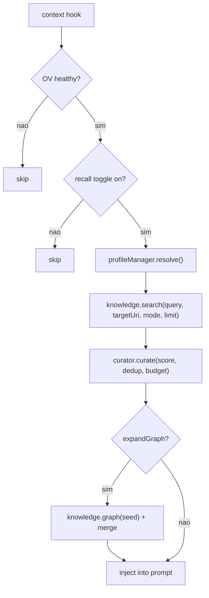

# Arquitetura do pi-openviking

> **Arquitetura Hexagonal (Ports & Adapters).**
> Domínio puro no centro. Adaptadores na periferia.
> Inversão de dependência: o núcleo não importa nada externo.

---

## Estado Atual

| Fase | Status | Artefatos |
|------|--------|-----------|
| **F1 Foundation** | ✅ Completo | ConfigSchema, Cascade, Logger (interface + FileLogger + NullLogger), Lifecycle, PathResolver. DI Container removido em ADR-021 — dependências criadas diretamente em `init()`. |
| **F2 Domain + Ports** | ✅ Completo | `domain/common/` ✅ · `domain/errors/` ✅ · `domain/knowledge/model/` ✅ · `domain/recall/model/` ✅ · 8 port interfaces ✅ · `domain/recall/curate.ts` (curation) ✅ · Prototype deleted ✅ |
| **F3 OV Adapter** | ✅ Completo | Transport + 6 mappers + 6 port implementations (FsStore, KnowledgeBase, SessionStore, GraphStore, ResourceStore, SkillStore) + adapter factory + DI wiring + smoke test. |
| **F4 Operations** | ✅ Completo | RecallConfig schema + scorers + curate pipeline + RecallCurator + RecallService + SessionManager + SessionSync + lifecycle wiring + smoke tests. Sem container — dependências criadas diretamente em `init()`. |
| **F5 Tools + Commands** | ✅ Completo (F5.1–F5.5 ✅) | F5.1 ✅: OpenVikingClient + SearchClient + 3 search tools (pipeline/SearchService eliminados em ADR-021). F5.2 ✅: FsClient + ov_write + ov_read (FsStoreService eliminado). F5.3 ✅: ov_recall tool. F5.4 ✅: 9 slash commands. F5.5 ✅: Wiring (guard pattern + tool/command barrels) + OVWidget. 14 tools + 9 commands + widget operacionais. |
| **F6 Context Hook + Infra** | ✅ Completo | ADR-019: `context` hook replace `before_agent_start` p/ recall ✅ · Cache por query hash ✅ · SessionMapStore (port + FileSessionMapStore) ✅ · RepoContext (TTL cache + system prompt) ✅ · AutoCommit (`pollCommit()` + setInterval) ✅ · `autoCommitIntervalMs` config ✅ |

> Este documento descreve a **arquitetura alvo**. Componentes marcados como (futuro) ainda não existem.
> Para o estado atual do código, consulte a seção [6. Estrutura de Diretórios](#6-estrutura-de-diretórios).
> Para tipos compartilhados já implementados (`domain/common/`), veja [2. F2 — Ordem de Implementação](#2-f2--ordem-de-implementação).

---

## 1. Diagrama de Camadas

```mermaid
flowchart TB
    subgraph External["🌍 Mundo Externo"]
        PI["Pi Agent (MCP/CLI)"]
        OV["OpenViking Server :1933"]
        USER["Usuário (TUI)"]
    end

    subgraph Adapters["🔌 Adaptadores (Driving)"]
        direction TB
        TOOL_REGISTRY["Tool Registry\nregisterTool() → App Service"]
        CMD_REGISTRY["Command Registry\nregisterCommand() → App Service"]
        UI_HOOKS["UI Hooks\nsetStatus, autocomplete,\nnotify — registra no Pi"]
    end

    subgraph Client["🧩 OpenVikingClient (Flat Hexagon)"]
        direction TB
        CLIENT_SEARCH["SearchClient\nfind / search / glob / grep"]
        CLIENT_FS["FsClient\nread / save / list / tree / stat\nmkdir / mv / delete / reindex"]
        CLIENT_SESSION["SessionClient\ncreateSession / sendMessage / commit\ngetSession / getTaskStatus / ..."]
        CLIENT_RELATION["RelationClient\nlink / unlink / graph"]
        CLIENT_RESOURCE["ResourceClient\nimportUrl"]
        CLIENT_SKILL["SkillClient\naddSkill"]
    end

    subgraph Ports["🚪 Portas Internas (Adapters)"]
        direction TB
        PORT_LOGGER["Logger\ndebug / info / warn / error"]
    end

    subgraph Domain["🧠 Domínio (3 Bounded Contexts)"]
        direction TB
        DOMAIN_KNOW["Knowledge Context\nKnowledgeItem, Resource,\nUri, SessionId"]
        DOMAIN_RECALL["Recall Context\nRecallItem, TokenBudget,\nRecallCurator, RecallService,\nGraphExpander"]
        DOMAIN_PROFILE["Profile Context\nProfileConfig (value object),\nProfileManager, AutoDetect"]
    end

    subgraph DomainSvc["🎯 Domain Services (F4 + ADR-021)"]
        direction TB
        RECALL_SVC["RecallService\ntoggle → KB → curator → result"]
        SESSION_MGR["SessionManager\nactive session + commit + poll"]
        SESSION_SYNC["SessionSync\nlifecycle coordination\n+ auto-commit timer"]
    end

    subgraph Impl["🔌 Adaptadores (Driven)"]
        direction TB
        OV_ADAPTER["OpenVikingAdapter\nImplementa KnowledgeBase\n+ FsStore + GraphStore\n+ SessionStore + ResourceStore\n+ SkillStore"]
        OV_TRANSPORT["Transport\nHTTP + Auth + Retry + RateLimit"]
        FILE_SESSION_MAP["FileSessionMapStore\nJSON file (atomic write)"]
        LOG_IMPL["FileLogger\nJSON lines + rotação"]
    end

    subgraph Infra["🏗️ Infraestrutura"]
        direction TB
        CONFIG["Config Cascade\ndefaults → env → file → profile"]
        REPO_CTX["RepoContext\nTTL cache + system prompt"]
        LIFECYCLE["Lifecycle\ninit() / shutdown()"]
    end

    PI --> TOOL_REGISTRY
    PI -->|pi.on()| DOMAIN_SVC
    USER --> CMD_REGISTRY
    USER --> UI_HOOKS

    TOOL_REGISTRY --> CLIENT_SEARCH
    TOOL_REGISTRY --> CLIENT_FS
    TOOL_REGISTRY --> CLIENT_SESSION
    TOOL_REGISTRY --> CLIENT_SKILL
    TOOL_REGISTRY --> CLIENT_RESOURCE

    CMD_REGISTRY --> CLIENT_FS
    CMD_REGISTRY --> CLIENT_SEARCH
    CMD_REGISTRY --> SESSION_MGR

    UI_HOOKS --> RECALL_SVC
    UI_HOOKS --> SESSION_MGR
    UI_HOOKS --> SESSION_SYNC

    RECALL_SVC --> PORT_LOGGER
    RECALL_SVC --> DOMAIN_RECALL
    SESSION_MGR --> CLIENT_SESSION
    SESSION_SYNC --> SESSION_MGR

    OV_ADAPTER --> OV_TRANSPORT
    OV_ADAPTER -.->|delegates to| CLIENT_SEARCH
    OV_ADAPTER -.->|delegates to| CLIENT_FS
    OV_ADAPTER -.->|delegates to| CLIENT_SESSION
    OV_ADAPTER -.->|delegates to| CLIENT_RELATION
    OV_ADAPTER -.->|delegates to| CLIENT_RESOURCE
    OV_ADAPTER -.->|delegates to| CLIENT_SKILL
    OV_TRANSPORT -->|HTTP| OV

    LOG_IMPL --> PORT_LOGGER

    LIFECYCLE --> CONFIG
    LIFECYCLE --> LOG_IMPL
    LIFECYCLE --> OV_ADAPTER
    LIFECYCLE --> SESSION_MGR
    LIFECYCLE --> RECALL_SVC
```

> **Nota sobre EventBus:** removido em F5 Review — dead code sem subscribers.
> Eventos de infra (session_start, message_end) são tratados por `pi.on()` diretamente.
> Não existe PiEventBridge separado. Cache de dados adiado para quando houver consumidor.
>

> **Nota sobre Widget:** OVWidget usa `ctx.ui.setWidget()` com info rica em 2 linhas:
> status de conexão, recall toggle, sessão ativa, escopo, métricas do último recall.
> Não há `status-bar.ts` separado — o widget é registrado em `index.ts` e atualizado
> por eventos.

---

## 2. F2 — Ordem de Implementação

A ordem de criação dos artefatos de domínio segue dependências entre eles:

| Passo | Artefato | Depende |
|-------|----------|---------|
| 1 | `domain/common/` — Uri (class), SessionId (class), ContentLevel, WriteMode, FindQuery + SearchRequest (interfaces), Part (discriminated union) | — |
| 2 | `domain/errors/` — DomainError class + subtipos (NotFoundError, ConnectionError, etc.) | — |
| 3 | `domain/{knowledge,recall,profile}/model/` — value objects + aggregates | common, errors |
| 4 | `domain/ports/` — Logger, SessionMapStore (ports remanescentes). Demais interfaces migraram para `domain/client/open-viking-client.ts` como sub-interfaces (SearchClient, FsClient, SessionClient, RelationClient, ResourceClient, SkillClient) no ADR-021 Flat Hexagon. | models (tipos de retorno) |
| 5 | `domain/recall/curate.ts` — curate pipeline (pure function) | domain models |

ProfileManager implementado em F7a. ProfileBehavior (6 campos) + AutoDetect em F7b.

---

## 3. OpenVikingClient — Interface Única (Flat Hexagon)

Com ADR-021, as 8 ports de domínio foram substituídas por uma única interface `OpenVikingClient`
composta de 6 sub-interfaces, definida em `domain/client/open-viking-client.ts`.
As únicas ports remanescentes em `domain/ports/` são `Logger` e `SessionMapStore`.

### SearchClient — busca semântica e lexical

Dois endpoints de busca OV:
- `POST /api/v1/search/find` — find(), sem sessão, sem intent analysis, baixa latência
- `POST /api/v1/search/search` — search(), com sessão + intent analysis server-side, alta latência
- `POST /api/v1/search/glob` (pattern, uri root scope, node_limit)
- `POST /api/v1/search/grep` (uri, pattern, case_insensitive, exclude_uri, level_limit, node_limit)

```typescript
interface SearchClient {
  find(query: FindQuery, opts?: SearchOptions, signal?: AbortSignal): Promise<SearchResult>;
  search(request: SearchRequest, opts?: SearchOptions, signal?: AbortSignal): Promise<SearchResult>;
  glob(pattern: string, uri?: string, limit?: number, signal?: AbortSignal): Promise<GlobResult>;
  grep(pattern: string, opts?: GrepOptions, signal?: AbortSignal): Promise<GrepResult>;
}
```

### RelationClient — navegação de relações

Mapeamento OV: `POST /api/v1/relations/link`, `DELETE /api/v1/relations/link`, `GET /api/v1/relations?uri=`.

```typescript
interface RelationClient {
  link(source: Uri, targets: Uri | Uri[], reason?: string, signal?: AbortSignal): Promise<LinkResult>;
  unlink(source: Uri, target: Uri, signal?: AbortSignal): Promise<void>;
  graph(uri: Uri, signal?: AbortSignal): Promise<Relation[]>;
}
```

### SessionClient — ciclo de vida de sessão OV

Mapeamento OV:
- `POST /api/v1/sessions` — createSession
- `POST /api/v1/sessions/{id}/messages` — sendMessage (1 mensagem, com role + Part[])
- `POST /api/v1/sessions/{id}/messages/batch` — sendMessages (max 100)
- `POST /api/v1/sessions/{id}/commit` — commit (com `keepRecentCount`)
- `POST /api/v1/sessions/{id}/used` — sessionUsed
- `GET /api/v1/tasks/{id}` — getTaskStatus
- `GET /api/v1/tasks` (com filtros) — listTasks
- `DELETE /api/v1/sessions/{id}` — deleteSession
- `GET /api/v1/sessions/{id}` — getSession

```typescript
interface SessionClient {
  createSession(signal?: AbortSignal): Promise<SessionId>;
  sendMessage(id: SessionId, role: string, parts: Part[], signal?: AbortSignal): Promise<void>;
  sendMessages(id: SessionId, msgs: { role: string; content: Part[] }[], signal?: AbortSignal): Promise<void>;
  commit(id: SessionId, opts?: CommitOptions, signal?: AbortSignal): Promise<CommitResult>;
  getSession(id: SessionId, signal?: AbortSignal): Promise<SessionInfo>;
  getTaskStatus(taskId: string, signal?: AbortSignal): Promise<TaskStatus>;
  sessionUsed(id: SessionId, contexts: Uri[], signal?: AbortSignal): Promise<void>;
  deleteSession(id: SessionId, signal?: AbortSignal): Promise<void>;
  listSessions(signal?: AbortSignal): Promise<SessionInfo[]>;
}
```

### FsClient — operações no filesystem OV

Interface única para ler, escrever, navegar e gerenciar o filesystem virtual do OpenViking.
ContentStore foi fundida — OV trata content e fs como o mesmo sistema.

Mapeamento OV:
- Leitura: `GET /api/v1/content/{read|abstract|overview}?uri=X` (abstract/overview apenas diretórios)
- Escrita: `POST /api/v1/content/write` (mode: replace|append|create, wait, timeout)
- Navegação: `GET /api/v1/fs/ls`, `GET /api/v1/fs/tree`, `GET /api/v1/fs/stat`
- Mutação: `POST /api/v1/fs/mkdir`, `POST /api/v1/fs/mv`, `DELETE /api/v1/fs`

```typescript
interface FsClient {
  read(uri: Uri, level?: ContentLevel, offset?: number, limit?: number, signal?: AbortSignal): Promise<Content>;
  save(uri: Uri, content: string, mode?: WriteMode, signal?: AbortSignal): Promise<WriteResult>;
  list(uri: Uri, recursive?: boolean, signal?: AbortSignal): Promise<FsEntry[]>;
  tree(uri: Uri, signal?: AbortSignal): Promise<FsEntry[]>;
  stat(uri: Uri, signal?: AbortSignal): Promise<FsEntry>;
  mkdir(uri: Uri, signal?: AbortSignal): Promise<void>;
  mv(from: Uri, to: Uri, signal?: AbortSignal): Promise<void>;
  delete(uri: Uri, recursive?: boolean, signal?: AbortSignal): Promise<void>;
  reindex(uri: Uri, mode?: ReindexMode, signal?: AbortSignal): Promise<void>;
}
```

> **ReindexMode**: `"vectors_only" | "full"`. Default `"vectors_only"` rebuilds vector embeddings; `"full"` rebuilds both scalar and vector indexes. Maps to OV `POST /api/v1/content/reindex {uri, mode}`. Defined in `domain/client/ov-types.ts`.

> `read()` aceita `level` que mapeia para as camadas L0/L1/L2 do OV:
> - `"abstract"` → L0. OV v0.3.24+: `GET /api/v1/content/abstract?uri=X` (diretórios apenas, retorna 412 em files)
> - `"overview"` → L1. OV v0.3.24+: `GET /api/v1/content/overview?uri=X` (diretórios apenas, retorna 412 em files)
> - `"read"` → L2 (conteúdo completo). OV: `GET /api/v1/content/read?uri=&offset=&limit=`
>
> `offset` (linha inicial, default 0) e `limit` (linhas, default -1) aplicam-se apenas ao nível `"read"`.
>
> `save()` não expõe `wait` no domínio — detalhe de transporte resolvido no adapter
> via `wait: false` (assíncrono — OV processa embedding em background).

> **Nota sobre scopes OV:** OV organiza conteúdo em 4 scopes públicos sob `viking://`:
> `resources/` (documentos), `user/{user_id}/` (memórias de usuário), `agent/{agent_id}/` (memórias/experiências do agent),
> `session/{user_space}/{session_id}/` (dados de sessão). O extension mapeia Pi sessions → OV sessions.
> Scopes `temp/` e `queue/` são internos, não acessíveis via API pública.

### Shared Types (domain/common/ + domain/client/ov-types.ts)

```typescript
// domain/common/content-level.ts
type ContentLevel = "abstract" | "overview" | "read";

// domain/common/write-mode.ts
type WriteMode = "replace" | "append" | "create";

// domain/common/search-query.ts
interface FindQuery {
  query: string;
  limit?: number;
  targetUri?: Uri;
}
interface SearchRequest {
  query: string;
  limit?: number;
  sessionId?: SessionId;
  targetUri?: Uri;
}

// domain/common/part.ts
interface TextPart { type: "text"; text: string }
interface ToolPart {
  type: "tool";
  toolId: string; toolName: string;
  toolInput: Record<string, unknown>;
  toolOutput: string; toolStatus: string;
  toolOutputTruncated: boolean;
  toolUri: string; skillUri: string;
  durationMs: number | null;
  promptTokens: number | null;
  completionTokens: number | null;
  toolOutputRef: string;
}
interface ContextPart { type: "context"; uri: string; contextType: "memory" | "resource" | "skill"; abstract: string }
type Part = TextPart | ToolPart | ContextPart;

// domain/client/ov-types.ts
export type ReindexMode = "vectors_only" | "full";
// Demais tipos: Content, WriteResult, FsEntry, GlobResult, GrepResult, CommitResult,
// SessionInfo, TaskStatus, LinkResult, ResourceImportResult, AddSkillResult, SkillData
```

### Logger — port remanescente em `domain/ports/`

```typescript
type LogLevel = "debug" | "info" | "warn" | "error";

interface Logger {
  info(msg: string, ctx?: Record<string, unknown>): void;
  warn(msg: string, ctx?: Record<string, unknown>): void;
  error(msg: string, ctx?: Record<string, unknown>): void;
  debug(msg: string, ctx?: Record<string, unknown>): void;
  isEnabled(level: LogLevel): boolean;
}
```

> Logger é síncrono por design — não precisa de `AbortSignal`. Única port de domínio remanescente junto com `SessionMapStore`.

---

## 4. Design Patterns

### 4.1 Command Pattern — Toda ação é um comando

```typescript
class RecallService {
  constructor(
    private knowledge: KnowledgeBase,
    private curator: RecallCurator,
    private config: RecallConfig,
  ) {}

  async recall(prompt: string): Promise<RecallResult> {
    const mode = this.config.searchMode; // 'find' | 'search', from RecallConfig
    const results = mode === 'search'
      ? await this.knowledge.search({ query: prompt, ... })
      : await this.knowledge.find({ query: prompt, ... });
    return {
      items: this.curator.curate(results, prompt),
      total: results.total,
    };
  }
}
```

### 4.2 Recall Toggle — User control

Recall is controlled by a toggle command (`/ov recall on` / `/ov recall off`).
No intent detection — user decides when recall fires.
`searchMode` comes from `RecallConfig` (default `'search'` — `z.enum(["find", "search"]).default("search")` em `infrastructure/config.ts`), overridable via profile.

### 4.3 Middleware Pipeline — REMOVIDO

Pipeline genérico (`Pipeline<T>`) e `LoggingMiddleware` foram removidos em ADR-021 (Flat Hexagon).
Cada tool handler agora usa inline try/catch + logger. A abstração de 140 linhas não se justificava
para um único middleware — tool-handler-level cross-cutting concerns foram movidos para o Transport
(circuit breaker, retry, error mapping) e para o `context` hook (caching de recall).

**Arquivos eliminados:** `domain/pipeline/` (diretório inteiro removido).

### 4.4 Event Bus — REMOVIDO

EventBus de domínio foi removido em F5 Review — dead code sem subscribers, sem publisher,
e sem API de eventos no OV. Eventos de infra (session_start, message_end, etc.)
são tratados diretamente por `pi.on()` em `index.ts`. Cache de dados adiado até existir consumidor concreto.

### 4.5 Perfis de Comportamento (Profiles)

Quatro built-in profiles: `default`, `web-dev`, `docs`, `learning`. Cada um carrega opcionalmente `ProfileBehavior` (6 campos: targetUri, topN, scoreThreshold, searchMode, expandGraph, autoRecall) que sobrescreve `RecallConfig`.

Fluxo de resolução:
1. `loadConfig()` carrega e valida config (defaults → env → file)
2. `init()` cria `ProfileManager`, chama `resolve(activeProfile)`
3. `mergeBehaviorIntoRecall()` deep-merges ProfileBehavior em RecallConfig
4. Serviços recebem merged config — não sabem que profiles existem

Comando `/ov-profile {show|list|apply|detect}` permite troca em runtime (F7b).
`AutoDetect` mapeia padrões de diretório (minimatch) para profiles via regras em config.

Arquivos: `domain/profile/service/ProfileManager.ts`, `domain/profile/service/auto-detect.ts`.
Config: `profile-schema.ts` (ProfileSchema + ProfileBehaviorSchema).
Domain interfaces: `domain/common/profile-config.ts`.

---

## 5. Fluxos Principais

### 5.1 Auto-Recall (visão completa — F5–F8)

Diagrama mostra fluxo completo incluindo componentes futuros (profileManager em F7, expandGraph em F8).
Auto-recall usa o hook `context` (por ADR-019), não `before_agent_start` (que é usado apenas para RepoContext).



### 5.2 Session Sync

Evento `message_end` chega via `pi.on()` e chama SessionManager direto.
EventBus de domínio não transporta eventos de infra.

**session_before_switch**: dispara antes de `/new` ou `/resume`. Commita sessão OV ativa.
Em caso de falha, retenta uma vez (500ms). Se retry falhar, mostra confirm pro usuário:
cancelar → `{ cancel: true }`, confirmar → switch prossegue.
Sucesso → seta flag `skipShutdownCommit` para evitar double-commit no `session_shutdown`.

**Resume/Fork re-hydrate**: quando `session_start` chega com `reason: "resume"` ou `"fork"`,
o handler lê as últimas 50 entradas de `ctx.sessionManager.getBranch()`, filtra
`user`/`assistant`, mapeia via `agentMessageToParts()` e envia em batch via
`sessionManager.sendMessages()`.

### 5.3 system/status — Observability

`GET /api/v1/system/status` retorna `{ initialized: boolean, user?: string }`.
Chamado via `SystemStatusClient` (usa Transport com headers de autenticação).
Usado pelo comando `/ov-status` para mostrar estado vivo do servidor.
Nunca lança — em caso de erro retorna `{ initialized: false }`.

### 5.4 ov_search — Advanced Search Params

Além de `query`, `mode`, `limit`, `targetUri`, `peerId`, o tool schema agora expõe
6 parâmetros avançados opcionais: `scoreThreshold`, `since`, `until`, `timeField`,
`level`, `includeProvenance`. Eles são passados como `SearchOptions` para o adapter OV,
que os serializa diretamente no body do POST `/api/v1/search/{find,search}`.

### 5.5 Lifecycle Hook Resumo

| Hook | Propósito |
|------|-----------|
| `session_start` | Health check + session creation + re-hydrate |
| `session_before_switch` | Commit OV + confirm user |
| `session_shutdown` | Commit (ou skip se flag set) + cleanup |
| `message_end` | Sync user message → OV |
| `turn_end` | Merge assistant + tool results → OV |
| `context` | Auto-recall via RecallService |
| `before_agent_start` | RepoContext injection |

---

## 6. Estrutura de Diretórios

```
src/
├── domain/                    # Pure TS. Sem imports externos.
│   ├── common/                # ✅ Shared kernel: Uri, SessionId, ContentLevel, WriteMode, FindQuery, SearchRequest, Part
│   ├── knowledge/             # (futuro F2) Contexto: armazenamento e busca
│   │   ├── model/             # ✅ KnowledgeItem, ResourceItem, SkillItem, SearchResult, Relation
│   │   └── service/           # (futuro) SemanticSearch
│   ├── recall/                # ✅ Contexto: curadoria
│   │   ├── model/             # ✅ RecallItem, TokenBudget
│   │   ├── curate.ts          # ✅ Curation pipeline + scorers + Scorer type
│   │   ├── recall-curator.ts  # ✅ RecallCurator wrapper over curate()
│   │   └── recall-service.ts  # ✅ RecallService: toggle → KB → curator → RecallResult
│   ├── client/                # ✅ OpenVikingClient port (Flat Hexagon)
│   │   └── open-viking-client.ts # ✅ 6 sub-interfaces: SearchClient, FsClient, SessionClient, RelationClient, ResourceClient, SkillClient
│   ├── services/              # ✅ Domain services com estado
│   │   ├── session-service.ts  # ✅ SessionManager: active session + commit + polling (renamed from SessionService in ADR-021)
│   │   └── session-sync-service.ts # ✅ SessionSync: lifecycle coordination + auto-commit timer (added in ADR-021)
│   ├── profile/               # (futuro F7) Contexto: perfis de comportamento
│   │   ├── model/             # ProfileConfig, AutoDetectRule
│   │   └── service/           # ProfileManager, ProfileResolver, AutoDetect
│   ├── ports/                 # ✅ Interfaces planas (todas implementadas)
│   │   ├── logger.ts          # ✅ Logger
│   │   ├── knowledge-base.ts  # ✅ KnowledgeBase + GlobResult, GrepOptions, GrepResult
│   │   ├── fs-store.ts        # ✅ FsStore + Content, WriteResult, FsEntry
│   │   ├── graph-store.ts     # ✅ GraphStore + LinkResult
│   │   ├── session-store.ts   # ✅ SessionStore + CommitResult, TaskStatus
│   ├── session-map-store.ts # ✅ SessionMapStore + SessionMeta
│   └── skill-store.ts       # ✅ SkillStore + AddSkillResult
│   └── errors/                # ✅ DomainError, NotFoundError, ConnectionError, ValidationError
│
├── application/               # (não utilizado — pass-through services eliminados em ADR-021)
│
├── adapters/
│   ├── driver/pi-tools/       # ✅ F5.1–F5.6: 14 tools registradas
│   │   ├── ov-search.ts       # ✅ ov_search tool + TypeBox schema
│   │   ├── ov-search.test.ts  # ✅ 3 unit tests
│   │   ├── ov-glob.ts         # ✅ ov_glob tool
│   │   ├── ov-glob.test.ts    # ✅ 2 unit tests
│   │   ├── ov-grep.ts         # ✅ ov_grep tool
│   │   ├── ov-grep.test.ts    # ✅ 2 unit tests
│   │   ├── ov-write.ts        # ✅ ov_write tool (action: save|mkdir|mv)
│   │   ├── ov-write.test.ts   # ✅ 6 unit tests
│   │   ├── ov-read.ts         # ✅ ov_read tool (level: abstract|overview|read)
│   │   ├── ov-read.test.ts    # ✅ 4 unit tests
│   │   ├── ov-resource.ts     # ✅ ov_resource tool (validates viking://resources/)
│   │   ├── ov-resource.test.ts # ✅ 6 unit tests
│   │   ├── ov-skill.ts        # ✅ ov_skill tool (validates viking://skills/)
│   │   ├── ov-skill.test.ts   # ✅ 4 unit tests
│   │   ├── ov-import.ts       # ✅ ov_import tool (import external URLs)
│   │   ├── ov-import.test.ts  # ✅ 6 unit tests
│   │   ├── ov-session.ts      # ✅ ov_session tool (session metadata)
│   │   ├── ov-session.test.ts # ✅ tests
│   │   └── integration.test.ts # ✅ 8 integration tests (mock HTTP server)
│   ├── driver/pi-commands/    # ✅ F5.4: 9 slash commands
│   │   ├── ov-recall-command.ts  # ✅ /ov-recall on|off
│   │   ├── ov-status-command.ts  # ✅ /ov-status
│   │   ├── ov-tree-command.ts    # ✅ /ov-tree [uri]
│   │   ├── ov-commit-command.ts  # ✅ /ov-commit [--wait]
│   │   ├── ov-search-command.ts  # ✅ /ov-search <query>
│   │   ├── ov-delete-command.ts  # ✅ /ov-delete <uri>
│   │   ├── ov-profile-command.ts # ✅ /ov-profile {apply,list,show,detect}
│   │   ├── ov-start-command.ts   # ✅ /ov-start
│   │   ├── ov-reindex-command.ts # ✅ /ov-reindex <uri> [--mode]
│   │   └── command-registry.ts   # ✅ registerAllCommands() barrel
│   ├── driver/pi-lifecycle/     # ✅ F6: Lifecycle hooks + MessageMapper
│   │   ├── register-lifecycle-hooks.ts # ✅ registerLifecycleHooks() + handleSessionStart()
│   │   ├── message-mapper.ts     # ✅ agentMessageToParts() — 9 tests
│   │   └── message-mapper.test.ts # ✅ 9 tests (user/assistant/tool/empty/null/ImageContent)
│   ├── driver/pi-tools/         # ✅ F5.1–F5.6: 14 tools + barrel
│   │   ├── tool-registry.ts     # ✅ registerAllTools() barrel
│   └── driven/
│       ├── openviking/        # ✅ F3: Transport + 6 adapters + 6 mappers + factory
│       │   ├── circuit-breaker.ts # ✅ Pure state machine: CLOSED→OPEN→HALF_OPEN (8 tests)
│       │   ├── circuit-breaker.test.ts # ✅ 8 reducer tests + 3 integration tests
│       │   ├── health.ts          # ✅ HealthCheck adapter: /ready probe (bypasses CB)
│       │   ├── health.test.ts     # ✅ 4 tests (200, 503, latency, connection error)
│       │   ├── transport.ts       # ✅ HTTP client c/ auth, retry, timeout, abort, CB decorator (3 integration tests)
│       │   ├── fs-store.ts        # ✅ FsStoreAdapter (read/write/list/tree/stat/mkdir/mv/delete/reindex)
│       │   ├── knowledge-base.ts  # ✅ KnowledgeBaseAdapter (find/search/glob/grep)
│       │   ├── session-store.ts   # ✅ SessionStoreAdapter (create/send/commit/tasks/lifecycle)
│       │   ├── graph-store.ts     # ✅ GraphStoreAdapter (link/unlink/graph)
│       │   └── mappers/
│       │       ├── ov-mappers.ts      # ✅ toDomainError() + toContent() (consolidados em ov-mappers.ts)
│       │       ├── fs-mapper.ts       # ✅ toFsEntry/toFsEntries/toWriteResult
│       │       ├── search-mapper.ts   # ✅ toSearchResult/toGlobResult/toGrepResult
│       │       ├── session-mapper.ts  # ✅ toSessionId/toCommitResult/toTaskStatus + PartSerializer
│       │       └── relation-mapper.ts # ✅ toLinkResult/toRelations
│       ├── cache/             # (futuro) InMemoryCache — sem consumidor ainda
│       └── logger/
│           ├── file-logger.ts # ✅ FileLogger (JSON lines + rotação)
│           └── null-logger.ts # ✅ NullLogger (testes/silent mode)
│
├── infrastructure/
│   ├── config.ts              # ✅ ConfigSchema (Zod) + RecallConfigSchema + loadConfig() + mergeBehaviorIntoRecall() — consolidated from 5 files to 1 file in ADR-021
│   ├── config.test.ts         # ✅ Config tests
│   ├── lifecycle.ts           # ✅ init() + shutdown() — creates all services directly (no container)
│   ├── lifecycle.test.ts      # ✅ 22 smoke tests (F1–F3 adapters + F4 services + F5)
│   ├── repo-context.ts        # ✅ RepoContext — TTL cache + system prompt
│   ├── repo-context.test.ts   # ✅ RepoContext tests
│   └── path-resolver.ts       # ✅ PathResolver utilitário
│
├── index.ts                   # ✅ F5: init → resolve → registerAll → listen
                               # Guard initialized, bootstrap único,
                               # tools + commands registrados uma vez.
├── adapters/driven/openviking/client/
│   ├── client-adapter.ts       # ✅ OpenVikingClientAdapter — delegates to OVAdapter sub-adapters
│   ├── client-adapter.test.ts  # ✅ Client adapter tests
│   └── client-adapter.integration.test.ts # ✅ Integration tests
├── adapters/driver/ov-widget.ts  # ✅ OVWidget — 2-line status widget via setWidget()
├── adapters/driver/pi-lifecycle/ # ✅ F6: register-lifecycle-hooks.ts + message-mapper.ts
```

**Legenda:** ✅ existe agora | 🔧 F5 (em planejamento/implementação) | (futuro) ainda não implementado

> F2 — domain/common/ (#47), domain/errors/ + knowledge/recall models (#48), 6 port interfaces (#49) implementados 2026-05-27.
> F3 ✅ — Issues #52–#58: Transport + 6 mappers + 4 port implementations + adapter factory + smoke test concluídos 2026-05-27. DI wiring removed in ADR-021.
> F4 ✅ — Issues #61–#66: RecallConfig + scorers + curate pipeline + RecallCurator + RecallService + SessionManager + lifecycle wiring concluídos 2026-05-29. SessionSync added in ADR-021.
> F5 ✅ — F5.1 ✅ (issue #68, refactored ADR-021): OpenVikingClient + SearchClient + 3 search tools (pipeline/SearchService eliminados). F5.2 ✅ (issue #69, refactored ADR-021): FsClient + ov_write + ov_read (FsStoreService eliminado). F5.3 ✅ (issue #70): ov_recall tool. F5.4 ✅ (issue #71): 9 slash commands. F5.5 ✅ (issue #72): Wiring (guard pattern + barrels) + OVWidget.

---

## 7. Princípios Arquiteturais

1. **Domain pure** — Núcleo não importa Pi, OV, HTTP, nada externo
2. **Ports > Implementations** — Interfaces primeiro, implements depois
3. **Autonomia progressiva** — off → propose → auto
4. **Silent by default** — Nunca pergunte o que pode ser inferido
5. **Graceful degradation** — OV offline não quebra o Pi
6. ~~**Pipeline de middlewares** — Removido em ADR-021. Cross-cutting concerns de tool-handler foram movidos para Transport (circuit breaker, retry) e context hook (caching). Cada tool handler usa inline try/catch + logger.
7. **Cascading config** — Default → env → file → profile → inline
